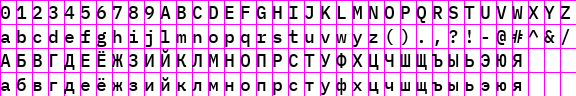

# PNG Font Generator

Bitmap font generator with uniform character spacing.

This generator generates png image divided into uniformly spaced 'cells' in
which the characters are rendered. The set of characters is loaded from
text file. The order of characters and line breaks is preserved.

## Usage

```
Usage: gen-font-map.py [OPTIONS] INPUT OUTPUT

Options:
  -f, --font TEXT                TTF font file  [required]
  -s, --size INTEGER             Font size
  -w, --cell-width INTEGER       Cell width
  -h, --cell-height INTEGER      Cell height
  --v-align [top|center|bottom]  Vertical alignment
  --h-align [left|center|right]  Horizontal alignment
  --color INTEGER RANGE...       Text color in RGBA format
  --background INTEGER RANGE...  Background color in RGBA format
  --debug                        Enables drawing grid line
  --help                         Show this message and exit.
```
You can use `-` as `input` argument on order to read input text file from 
`stdin`. If `-` is passed as `output` argument the resulting png will be written
into `stdout`.

## Example

```bash
python png-font.py input.txt out.png --font=IBMPlexMono-Medium.ttf --cell-width 16 --cell-height 24 --size 18
```
The contents of an input file is:

```
0123456789ABCDEFGHIJKLMNOPQRSTUVWXYZ
abcdefghijlmnopqrstuvwyz().,?!-@#^&/
АБВГДЕЁЖЗИЙКЛМНОПРСТУФХЦЧШЩЪЫЬЭЮЯ
абвгдеёжзийклмнопрстуфхцчшщъыьэюя
```

The resulting file `out.png` will look like follows.


### Debug option
In order to better align symbols insize cells you may enable debug option:

```bash
python png-font.py input.txt out.png --font=IBMPlexMono-Medium.ttf --cell-width 16 --cell-height 24 --size 18
```
